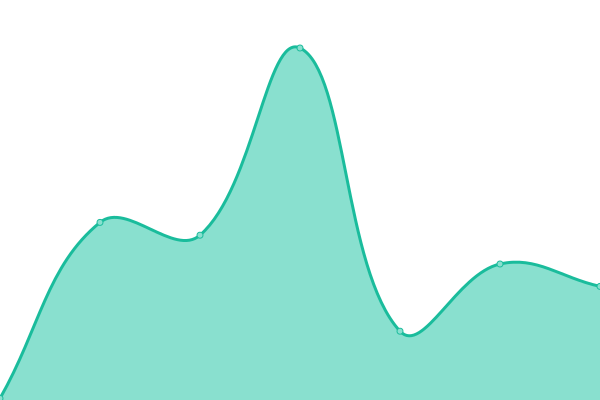
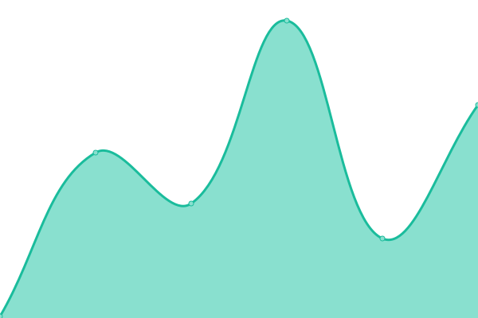
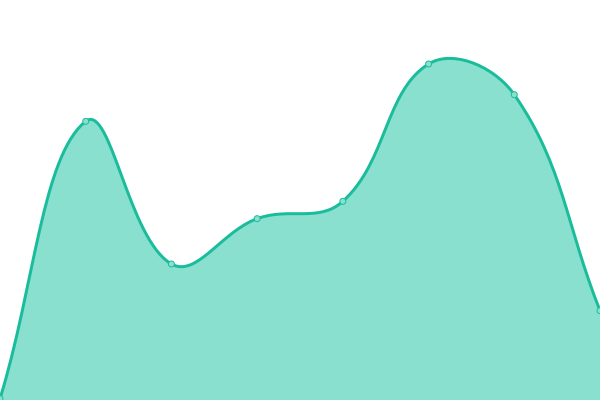
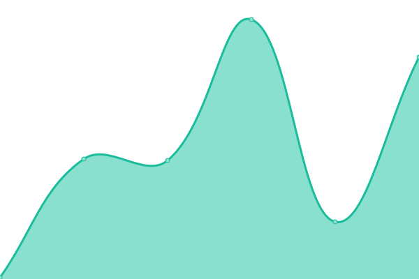
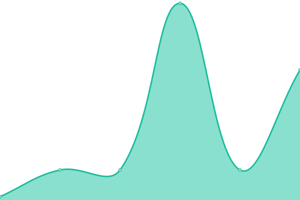
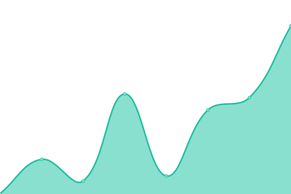

# [📈 Live Status](https://status.instanode.dev): <!--live status--> **🟧 Partial outage**

This repository contains the open-source uptime monitor and status page for [InstaNode.dev](https://status.instanode.dev), powered by [Upptime](https://github.com/upptime/upptime).

With [Upptime](https://upptime.js.org), you can get your own unlimited and free uptime monitor and status page, powered entirely by a GitHub repository. We use [Issues](https://github.com/InstaNode-dev/instant-status/issues) as incident reports, [Actions](https://github.com/InstaNode-dev/instant-status/actions) as uptime monitors, and [Pages](https://status.instanode.dev) for the status page.

With [Upptime](https://upptime.js.org), you get a free and open-source status page hosted on GitHub Pages. Probes run from GitHub-hosted runners; history is committed to `history/`; incidents are filed as Issues in this repo.

<!--start: status pages-->
<!-- This summary is generated by Upptime (https://github.com/upptime/upptime) -->
<!-- Do not edit this manually, your changes will be overwritten -->
<!-- prettier-ignore -->
| URL | Status | History | Response Time | Uptime |
| --- | ------ | ------- | ------------- | ------ |
|  [Marketing site](https://instanode.dev/) | 🟩 Up | [marketing-site.yml](https://github.com/InstaNode-dev/instant-status/commits/HEAD/history/marketing-site.yml) | 

 191ms
     
 | 

<a href="https://status.instanode.dev/history/marketing-site">100.00%</a>
    

|  [Agent API (healthz)](https://api.instanode.dev/healthz) | 🟥 Down | [agent-api-healthz.yml](https://github.com/InstaNode-dev/instant-status/commits/HEAD/history/agent-api-healthz.yml) | 

 0ms
     
 | 

<a href="https://status.instanode.dev/history/agent-api-healthz">0.00%</a>
    

|  [Dashboard](https://instanode.dev/app/) | 🟩 Up | [dashboard.yml](https://github.com/InstaNode-dev/instant-status/commits/HEAD/history/dashboard.yml) | 

 100ms
     
 | 

<a href="https://status.instanode.dev/history/dashboard">100.00%</a>
    

|  [Postgres provisioning (POST /db/new)](https://api.instanode.dev/db/new) | 🟥 Down | [postgres-provisioning-post-db-new.yml](https://github.com/InstaNode-dev/instant-status/commits/HEAD/history/postgres-provisioning-post-db-new.yml) | 

 0ms
     
 | 

<a href="https://status.instanode.dev/history/postgres-provisioning-post-db-new">0.00%</a>
    

|  [Redis provisioning (POST /cache/new)](https://api.instanode.dev/cache/new) | 🟥 Down | [redis-provisioning-post-cache-new.yml](https://github.com/InstaNode-dev/instant-status/commits/HEAD/history/redis-provisioning-post-cache-new.yml) | 

 0ms
     
 | 

<a href="https://status.instanode.dev/history/redis-provisioning-post-cache-new">0.00%</a>
    

|  [MongoDB provisioning (POST /nosql/new)](https://api.instanode.dev/nosql/new) | 🟥 Down | [mongo-db-provisioning-post-nosql-new.yml](https://github.com/InstaNode-dev/instant-status/commits/HEAD/history/mongo-db-provisioning-post-nosql-new.yml) | 

 0ms
     
 | 

<a href="https://status.instanode.dev/history/mongo-db-provisioning-post-nosql-new">0.00%</a>
    

|  [Queue provisioning (POST /queue/new)](https://api.instanode.dev/queue/new) | 🟥 Down | [queue-provisioning-post-queue-new.yml](https://github.com/InstaNode-dev/instant-status/commits/HEAD/history/queue-provisioning-post-queue-new.yml) | 

 0ms
     
 | 

<a href="https://status.instanode.dev/history/queue-provisioning-post-queue-new">0.00%</a>
    

|  [Storage provisioning (POST /storage/new)](https://api.instanode.dev/storage/new) | 🟥 Down | [storage-provisioning-post-storage-new.yml](https://github.com/InstaNode-dev/instant-status/commits/HEAD/history/storage-provisioning-post-storage-new.yml) | 

 0ms
     
 | 

<a href="https://status.instanode.dev/history/storage-provisioning-post-storage-new">0.00%</a>
    

|  [Webhook provisioning (POST /webhook/new)](https://api.instanode.dev/webhook/new) | 🟥 Down | [webhook-provisioning-post-webhook-new.yml](https://github.com/InstaNode-dev/instant-status/commits/HEAD/history/webhook-provisioning-post-webhook-new.yml) | 

 0ms
     
 | 

<a href="https://status.instanode.dev/history/webhook-provisioning-post-webhook-new">0.00%</a>
    

|  [Deploy provisioning (POST /deploy/new)](https://api.instanode.dev/deploy/new) | 🟥 Down | [deploy-provisioning-post-deploy-new.yml](https://github.com/InstaNode-dev/instant-status/commits/HEAD/history/deploy-provisioning-post-deploy-new.yml) | 

 0ms
     
 | 

<a href="https://status.instanode.dev/history/deploy-provisioning-post-deploy-new">0.00%</a>
    

|  [Customer Postgres (pg.instanode.dev TCP)](pg.instanode.dev) | 🟥 Down | [customer-postgres-pg-instanode-dev-tcp.yml](https://github.com/InstaNode-dev/instant-status/commits/HEAD/history/customer-postgres-pg-instanode-dev-tcp.yml) | 

 0ms
     
 | 

<a href="https://status.instanode.dev/history/customer-postgres-pg-instanode-dev-tcp">0.00%</a>
    

|  [OpenAPI spec (api.instanode.dev/openapi.json)](https://api.instanode.dev/openapi.json) | 🟥 Down | [open-api-spec-api-instanode-dev-openapi-json.yml](https://github.com/InstaNode-dev/instant-status/commits/HEAD/history/open-api-spec-api-instanode-dev-openapi-json.yml) | 

 0ms
     
 | 

<a href="https://status.instanode.dev/history/open-api-spec-api-instanode-dev-openapi-json">0.00%</a>
    

<!--end: status pages-->

## [Status page](https://status.instanode.dev)

The live status page is at <https://status.instanode.dev>. Incidents that fire because an endpoint returns a non-success code automatically open as Issues here; they close when the endpoint recovers.

## What's monitored

Configured in [`.upptimerc.yml`](.upptimerc.yml):

**Public web** — marketing front door, agent API health, dashboard, OpenAPI spec.

**The 7-service agent bundle** — Postgres, Redis, MongoDB, NATS queue, MinIO storage, webhook receiver, and container deploy. POST-only routes are probed with GET and accept `405 Method Not Allowed` as the success signal (the route is registered).

## Setup notes

See [`SETUP.md`](SETUP.md) for the two human-ops steps required to enable auto-rewrite of this README (a `GH_PAT` secret + branch-protection allowance).

## License

- Code: [MIT](./LICENSE) © [InstaNode-dev](https://github.com/InstaNode-dev)
- Status website: [MIT](https://github.com/upptime/upptime.js.org/blob/master/LICENSE) © [Anand Chowdhary](https://anandchowdhary.com)
- Summary template, workflows, response-time, graphs: [MIT](https://github.com/upptime/upptime/blob/master/LICENSE) © [Anand Chowdhary](https://anandchowdhary.com)
